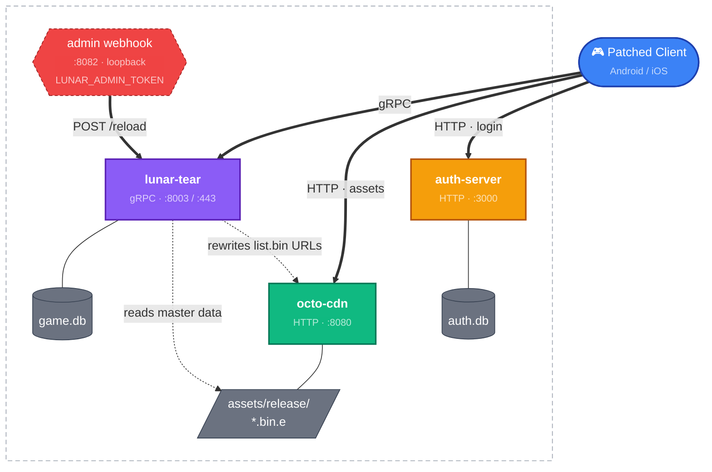

This guide is for running Lunar Tear as a real server — multiple services, possibly on separate machines, exposed to remote clients, with controlled account registration and live master-data reloads.

For a single-machine local setup, use the [Quick Setup](/guide/setup-quick/) instead.

## Topology

Lunar Tear is split into three independent binaries. They can run on one host or be spread across separate machines.



> The "Server Host(s)" box represents one or more machines — the three services can all live on a single box or be split across separate hosts (see [Path 2 — Bare-metal / split hosts](#path-2--bare-metal--split-hosts) below).

| Service       | Binary        | Default port | Role                                                                     |
| ------------- | ------------- | ------------ | ------------------------------------------------------------------------ |
| Game server   | `lunar-tear`  | `8003` / `443` | gRPC game logic; reads `db/game.db` and `assets/release/*.bin.e`        |
| Asset CDN     | `octo-cdn`    | `8080`       | HTTP server for asset bundles, `list.bin` rewriting, master data         |
| Auth server   | `auth-server` | `3000`       | Player registration and login; issues HMAC tokens validated by the game  |
| Admin webhook | `lunar-tear`  | `8082`       | Live master-data reload; **only binds when `LUNAR_ADMIN_TOKEN` is set**, loopback by default |

The auth server is optional — if the game server is started without `--auth-url`, registration is bypassed and clients get throwaway UUID-bound accounts.

## Path 1 — Docker Compose (recommended for servers)

The repo ships a `docker-compose.yaml` that brings up all three services, persists `db/` and `assets/`, and runs migrations automatically.

### 1. Prepare

```bash
git clone https://github.com/Walter-Sparrow/lunar-tear
cd lunar-tear/server
```

Populate `server/assets/` with the asset tree (not distributed here).

### 2. Configure

The compose file reads `LUNAR_ADMIN_TOKEN` from the environment. Set it in a `.env` file alongside `docker-compose.yaml` if you want the admin webhook enabled:

```bash
echo "LUNAR_ADMIN_TOKEN=$(openssl rand -hex 32)" > .env
```

Edit `docker-compose.yaml` to set `LUNAR_PUBLIC_ADDR` to the address clients will use to reach the game server (e.g. your server's public IP and port). The CDN's `--public-addr` is rewritten into `list.bin` URLs the client downloads, so it must also be reachable from clients — update the `command:` field on the `cdn` service accordingly.

### 3. Bring it up

```bash
docker compose up -d
```

| Service  | Image                       | Published port              |
| -------- | --------------------------- | --------------------------- |
| `server` | `kretts/lunar-tear:latest`  | `8003` (gRPC), `127.0.0.1:8082` (admin webhook, loopback) |
| `cdn`    | `kretts/octo-cdn:latest`    | `8080`                      |
| `auth`   | `kretts/auth-server:latest` | `3000`                      |

Volumes:

- `./db` → game + auth SQLite databases (persists across restarts)
- `./assets` → asset tree (read-mounted into both `server` and `cdn`)

### 4. Configure the game server via env vars

| Env var              | Description                                                                           |
| -------------------- | ------------------------------------------------------------------------------------- |
| `LUNAR_LISTEN`       | gRPC bind address                                                                     |
| `LUNAR_PUBLIC_ADDR`  | Client-facing host:port advertised to the game                                        |
| `LUNAR_OCTO_URL`     | CDN base URL the client uses for assets                                               |
| `LUNAR_AUTH_URL`     | Auth server base URL (omit to disable auth)                                           |
| `LUNAR_ADMIN_LISTEN` | Admin webhook bind address inside the container (compose default: `0.0.0.0:8082`)     |
| `LUNAR_ADMIN_TOKEN`  | Bearer token for the admin webhook. **Webhook does not bind unless this is set.**     |

## Path 2 — Bare-metal / split hosts

Run each service directly with `go run` (or pre-built binaries) for full control. This is the right path when the CDN, game server, and auth server live on different machines.

### Build

```bash
cd server
make build-all   # produces bin/lunar-tear, bin/octo-cdn, bin/auth-server
```

### Migrate the game DB

```bash
make migrate
# or manually:
mkdir -p db
goose -dir migrations -allow-missing sqlite3 db/game.db up
```

### Start the CDN

```bash
./bin/octo-cdn \
  --listen 0.0.0.0:8080 \
  --public-addr cdn.example.com:8080 \
  --assets-dir /var/lib/lunar-tear
```

| Flag            | Default          | Description                                          |
| --------------- | ---------------- | ---------------------------------------------------- |
| `--listen`      | `0.0.0.0:8080`   | Local bind address                                   |
| `--public-addr` | `127.0.0.1:8080` | Externally-reachable address used in `list.bin` rewriting |
| `--assets-dir`  | `.`              | Root directory containing the `assets/` tree         |

The `--public-addr` is critical — `list.bin` is rewritten on the fly so the client downloads assets from this address. If it's wrong, the client can't fetch anything.

### Start the auth server

```bash
./bin/auth-server \
  --listen 0.0.0.0:3000 \
  --db db/auth.db \
  --secret $(openssl rand -hex 32)
```

| Flag            | Default        | Description                                                       |
| --------------- | -------------- | ----------------------------------------------------------------- |
| `--listen`      | `0.0.0.0:3000` | HTTP listen address                                               |
| `--db`          | `db/auth.db`   | SQLite database for auth users                                    |
| `--secret`      | _(random)_     | Hex-encoded HMAC secret for token signing — pass the same value across restarts to keep existing tokens valid |
| `--no-register` | `false`        | Disable open registration                                         |

:::caution[Secret rotation]
If `--secret` is omitted, a random key is generated and printed at startup. Save it and pass it back on the next launch — otherwise all issued tokens become invalid.
:::

### Start the game server

```bash
./bin/lunar-tear \
  --listen 0.0.0.0:8003 \
  --public-addr game.example.com:8003 \
  --octo-url https://cdn.example.com:8080 \
  --auth-url http://auth.example.com:3000 \
  --db db/game.db
```

| Flag             | Default          | Description                                                  |
| ---------------- | ---------------- | ------------------------------------------------------------ |
| `--listen`       | `0.0.0.0:443`    | gRPC bind address                                            |
| `--public-addr`  | `127.0.0.1:443`  | Externally-reachable address advertised to clients           |
| `--octo-url`     | _(required)_     | CDN base URL                                                 |
| `--auth-url`     | _(empty)_        | Auth server base URL (omit to disable auth)                  |
| `--db`           | `db/game.db`     | SQLite database path                                         |
| `--admin-listen` | `127.0.0.1:8082` | Admin webhook bind (only active when `LUNAR_ADMIN_TOKEN` set) |
| `--no-register`  | `false`          | Reject any client whose UUID isn't already in the DB         |

### Port 443

The default `--listen` is `0.0.0.0:443`, which requires root. Either run with `sudo`, switch to a high port via `--listen` (requires a patched client matching), or grant the binary the capability on Linux:

```bash
sudo setcap cap_net_bind_service=+ep ./bin/lunar-tear
./bin/lunar-tear --public-addr game.example.com:443 --octo-url https://cdn.example.com:8080
```

## Path 3 — Single-host dev runner

Halfway between the wizard and the split-host setup — useful when you want all three services on one machine but need finer flag control than the wizard exposes.

```bash
cd server
make dev
# or
go run ./cmd/dev \
  --grpc.listen 0.0.0.0:9000 \
  --grpc.public-addr 10.0.2.2:9000 \
  --cdn.public-addr 192.168.1.50:8080
```

The dev runner builds each service into `bin/` first (so Windows Firewall only prompts once per binary) and runs all three with colored, prefixed logs (`[auth]`, `[cdn]`, `[grpc]`). `Ctrl+C` stops everything.

Selected flags:

| Flag                 | Default                 | Description                                |
| -------------------- | ----------------------- | ------------------------------------------ |
| `--auth.listen`      | `0.0.0.0:3000`          | Auth server listen address                 |
| `--cdn.listen`       | `0.0.0.0:8080`          | CDN local bind                             |
| `--cdn.public-addr`  | `10.0.2.2:8080`         | CDN externally-reachable address           |
| `--grpc.listen`      | `0.0.0.0:8003`          | Game server gRPC bind                      |
| `--grpc.public-addr` | `10.0.2.2:8003`         | Game server externally-reachable address   |
| `--grpc.octo-url`    | `http://10.0.2.2:8080`  | CDN URL passed to game server              |
| `--grpc.auth-url`    | `http://localhost:3000` | Auth URL passed to game server             |
| `--no-register`      | `false`                 | Disable open registration server-wide      |
| `--admin.listen`     | _(empty)_               | Game server admin webhook bind             |

## Controlled access (no open registration)

For a private server where you want to gate accounts, pass `--no-register` (or use `LUNAR_NO_REGISTER=true` via env) to the game server *and* the auth server. Then create accounts manually:

```bash
cd server
go run ./cmd/register-account \
  --name "PlayerName" \
  --password "PlayerPassword" \
  --platform android
```

| Flag         | Default      | Description                                       |
| ------------ | ------------ | ------------------------------------------------- |
| `--name`     | _(required)_ | Auth account nickname                             |
| `--password` | _(required)_ | Auth account password                             |
| `--platform` | `android`    | `android` or `ios`                                |
| `--db`       | `db/game.db` | Main SQLite path                                  |
| `--auth-db`  | `db/auth.db` | Auth SQLite path                                  |

This creates a row in both databases and binds them together. The player chooses their in-game nickname on first login — the auth nickname is just for sign-in.

## Claiming an existing account

If a new client connects and creates a throwaway account but you want it to load a pre-existing one (e.g. after restoring a snapshot):

```bash
go run ./cmd/claim-account --name "PlayerName" --db db/game.db
```

This looks up the player by in-game name, reassigns the most-recently-connected client's UUID to that account, and deletes the throwaway. Useful for migrating accounts or recovering after a wipe.

## Importing a snapshot

To seed an account with a JSON snapshot — e.g. a preserved end-of-service save:

```bash
make import SNAPSHOT=snapshots/scene_1.json UUID=<your-client-uuid>
```

Or directly:

```bash
go run ./cmd/import-snapshot \
  --snapshot snapshots/scene_1.json \
  --uuid <your-client-uuid> \
  --db db/game.db
```

The `--uuid` value must match the UUID your client sends during authentication.

## Live master-data reload

Edit `assets/release/20240404193219.bin.e` on disk, then POST to the admin webhook:

```bash
curl -X POST \
  -H "Authorization: Bearer ${LUNAR_ADMIN_TOKEN}" \
  http://127.0.0.1:8082/api/admin/master-data/reload
```

The server atomically swaps every in-memory catalog and bumps the file's mtime — the next time a client polls `GetLatestMasterDataVersion` it'll see a new version and re-download from the CDN. No restart, no dropped connections.

Security model (fail-closed):

- `LUNAR_ADMIN_TOKEN` **must** be set in the environment, or the webhook never binds at all.
- `--admin-listen` defaults to `127.0.0.1:8082` (loopback only). Bind to `0.0.0.0` only if you intend to expose it (and put it behind something like nginx with mTLS).
- Token comparison is constant-time.

## Backups

The wizard creates a backup of `db/game.db` on every launch. When running services directly, automate this yourself or use `make restore` for the interactive picker:

```bash
cd server
make restore
```

## Makefile cheatsheet

All targets run from `server/`:

| Target            | Purpose                                                |
| ----------------- | ------------------------------------------------------ |
| `make build-all`  | Build all service binaries into `bin/`                 |
| `make migrate`    | Run goose migrations on `db/game.db`                   |
| `make dev`        | Launch all three services with colored logs            |
| `make restore`    | Interactive restore of `db/game.db` from `db/backups/` |
| `make import`     | Import a snapshot (`SNAPSHOT=... UUID=...`)            |
| `make proto`      | Regenerate protobuf stubs                              |
| `make clean`      | Remove `bin/`                                          |

## Next steps

- For day-to-day questions, see the [FAQ](/guide/faq/)
- For new server builds, watch the [Releases](/releases/) page
- For help running multi-host or production-ish setups, ask in `#support` on [Discord](https://discord.gg/MZAf5aVkJG)
